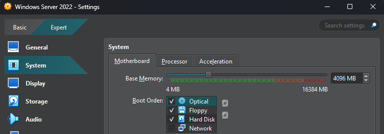
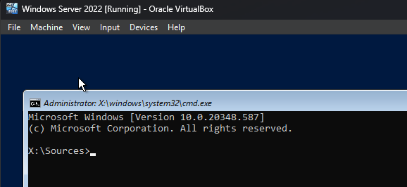
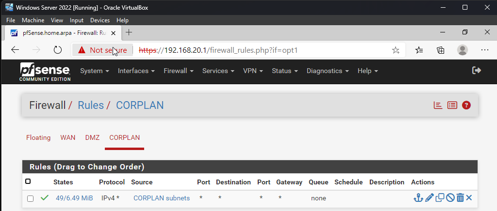
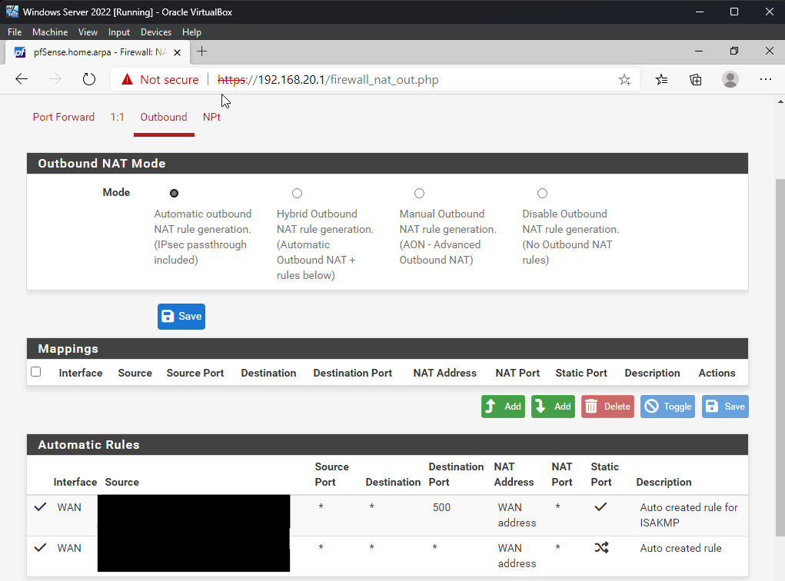
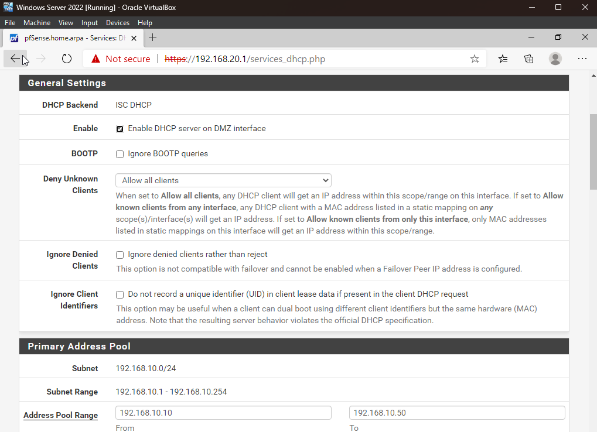
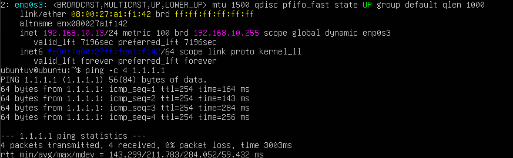
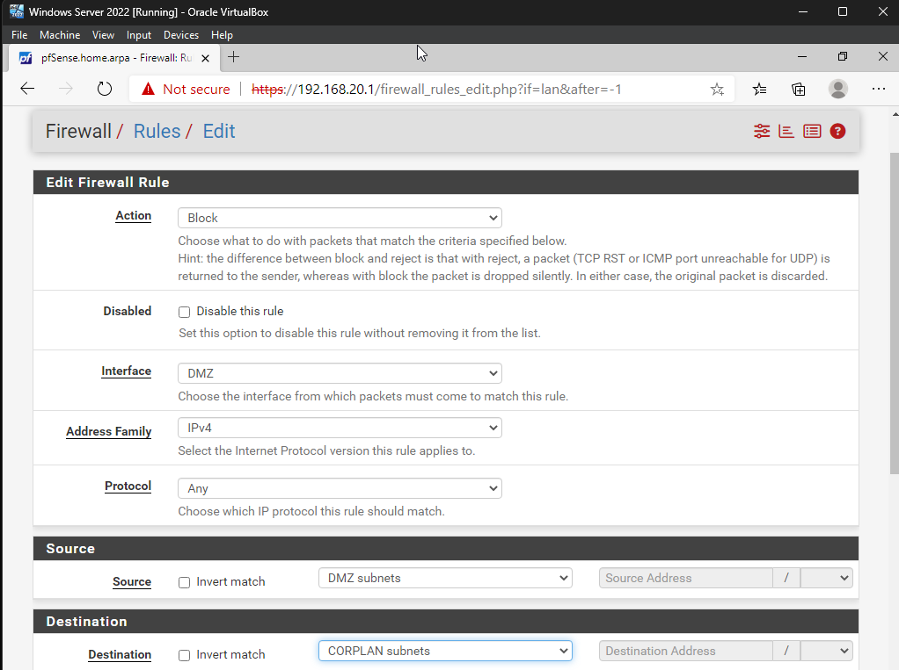
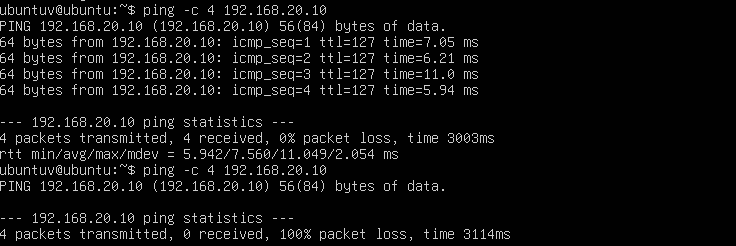

# Project RedLine: An Aggressive Pentesting & Evasion Homelab

### Executive Summary

This project builds and validates a segmented three-tier lab inside a virtualized sandbox. pfSense Community Edition acts as the perimeter firewall and routing layer across three zones: a WAN edge, a public-facing DMZ, and a restricted corporate management network.

The goal is to replace a flat lab network with strict segmentation and controlled trust boundaries. The implementation includes outbound NAT, custom DNS behavior, and stateful firewall rules that govern inter-zone traffic.

The project also includes hands-on recovery and remediation work:

* **Infrastructure account recovery:** Restored access to a locked Windows Server image through a boot-level `Utilman.exe` swap.
* **Operating system stabilization:** Resolved Windows Server 2022 evaluation issues that caused forced shutdowns.
* **Security leak remediation:** Identified and fixed a firewall rule leak that allowed lateral movement from the DMZ into the management network.


All testing occurred inside an isolated homelab on systems used for research and training.


### Lab at a glance

* **Zones:** WAN, DMZ (`192.168.10.0/24`), and CorpLAN (`192.168.20.0/24`)
* **Key systems:** pfSense, Ubuntu Server, and Windows Server 2022
* **Core services:** NAT, DHCP, DNS, and stateful firewall policy
* **Final outcome:** DMZ hosts retain outbound internet access, while CorpLAN remains isolated from lateral movement

### Architecture

```
                                [ PUBLIC INTERNET ]
                                        │
                                    (WAN DHCP)
                                        ▼
                           ┌─────────────────────────┐
                               │ pfSense Firewall │
                           └────┬───────────────┬────┘
                                       │ │
                                 (em1) ▼ ▼ (em2)
                    ┌──────────────────┐ ┌──────────────────┐
                         │ DMZ Network │ │ Corporate LAN │
                     │ 192.168.10.0/24 │ │ 192.168.20.0/24 │
                    └────────┬─────────┘ └────────┬─────────┘
                                       │ │
                                       ▼ ▼
                       ┌───────────────┐ ┌───────────────┐
                       │ Ubuntu Server │ │Windows Server │
                       │ 192.168.10.12 │ │ 192.168.20.10 │
                       └───────────────┘ └───────────────┘
```

**Legend**

* **WAN** — internet-facing edge connected through DHCP
* **DMZ** — public-facing application network
* **CorpLAN** — restricted internal management network

### Milestones

#### Milestone 1 — Local privilege escalation and administrator account recovery

**Problem**

Access to the Windows Server 2022 template was blocked by lost credentials.

**Action**

1. Modified the VirtualBox boot order to prioritize the Windows Server installation ISO.

<figure><figcaption><p>VirtualBox boot order updated to start from the Windows Server installation media.</p></figcaption></figure>

2. Rebooted into recovery and used `Shift + F10` to open a system-level command shell at `X:\Sources>`.

<figure><figcaption><p>Windows recovery shell opened from installation media.</p></figcaption></figure>

3. Replaced `utilman.exe` with `cmd.exe` to validate pre-authentication code execution:


```cmd
copy d:\\windows\\system32\\utilman.exe d:\\
copy d:\\windows\\system32\\cmd.exe d:\\windows\\system32\\utilman.exe
```


4. Rebooted to the sign-in screen, confirmed `NT AUTHORITY\SYSTEM` execution, and reset the local administrator password:


```
net user Administrator Password                                                                                 
```


**Result**

Administrative access was restored without reinstalling the operating system.

#### Milestone 2 — Network stack migration and core layer integration

**Problem**

The Windows Server host initially received an address inside the untrusted DMZ due to legacy deployment settings.

**Action**

1. Opened **Network Connections** with `ncpa.cpl`.
2. Changed the adapter IPv4 settings from static values to **Obtain an IP address automatically (DHCP)**.
3. Moved the VirtualBox internal adapter from the `DMZ` switch to the `CorpLAN` internal network.
4. Verified the new state:
   * IPv4 Address: `192.168.20.10`
   * Default Gateway: `192.168.20.1`
   * Domain Suffix: `home.arpa`

**Result**

The management host moved into the correct security zone and aligned with the intended network design.

#### Milestone 3 — Firewall interface alignment and branding

**Problem**

The default pfSense interface labels did not reflect the actual lab topology.

**Action**

1. Temporarily disabled packet filtering from the pfSense console to prevent lockout during reconfiguration:


```
pfctl -d
```


2. Opened the administrative interface at `https://192.168.20.1` in Microsoft Edge.
3. Navigated to **Interfaces → Assignments** and updated the interface names:
   * `LAN (em1)` → `DMZ` with gateway `192.168.10.1`
   * `OPT1 (em2)` → `CorpLAN` with gateway `192.168.20.1`

**Result**

The pfSense interface layout now matches the lab design and is easier to manage.

#### Milestone 4 — Outbound NAT and granular traffic control

**Problem**

The optional `CorpLAN` segment was treated as untrusted by default. It needed explicit rules for outbound access and controlled routing.

**Action**

1. Created a broad outbound allow rule under **Firewall → Rules → CorpLAN** to establish internet reachability.

<figure><figcaption><p>CorpLAN firewall rule allowing controlled outbound traffic.</p></figcaption></figure>

2. Verified outbound translation under **Firewall → NAT → Outbound**:
   * Target Network: `192.168.20.0/24`
   * Translation: `WAN address`

<figure><figcaption><p>Outbound NAT rule translating CorpLAN traffic through the WAN address.</p></figcaption></figure>

3. Tuned DNS under **System → General Setup**:
   * Primary DNS Server: `8.8.8.8`
   * Secondary DNS Server: `1.1.1.1`
   * Resolution behavior: `Use remote DNS Servers, ignore local DNS`

**Result**

CorpLAN gained stable outbound access without weakening internal trust boundaries.

#### Milestone 5 — Windows evaluation engine stabilization

**Problem**

Once WAN access was restored, Windows Server 2022 began shutting down automatically during normal operation.

**Action**

The issue traced back to evaluation license enforcement in the base image. To stabilize the host, the Microsoft Software License Manager was used to reinstall the license files and reset the trial state:


```
slmgr /rilc :: Re-installs evaluation license certificates to clear active volume corruption
slmgr /rearm :: Resets the 180-day evaluation trial validation timer back to baseline
shutdown /r /t 0
```


**Result**

The Windows management host returned to stable operation.

#### Milestone 6 — DMZ reprovisioning and Netplan remediation

**Problem**

The original Ubuntu server became unreliable during credential maintenance. The DMZ application tier needed a clean rebuild.

**Action**

1. Realigned the VirtualBox network profile by assigning Adapter 1 to the **Internal Network** named `DMZ`.
2. Corrected a Netplan indentation error in `/etc/netplan/00-installer-config.yaml` and restored DHCP-based addressing:


```
# This is the network config written by 'subiquity'

network:

  ethernets:

    enp0s3:

      match:

        macaddress: **:**:**:**:**:**

      set-name: enp0s3

      dhcp4: true

  version: 2
```


3. Enabled the DHCP pool under **Services → DHCP Server → DMZ** with a lease range from `192.168.10.10` to `192.168.10.50`.
4. Ran `sudo netplan apply` to request a new lease.

<figure><figcaption><p>Netplan corrected to support DHCP-based addressing on the DMZ host.</p></figcaption></figure>

<figure><figcaption><p>pfSense DMZ DHCP pool configured to assign addresses to public-facing hosts.</p></figcaption></figure>

**Result**

The rebuilt Ubuntu server joined the DMZ successfully and received a valid DHCP lease.

#### Milestone 7 — Zero-trust security validation

**Problem**

The final step needed to verify two outcomes: outbound connectivity from the DMZ and isolation from CorpLAN.

**Action**

**Test 1 — Outbound WAN connectivity**

Ran a basic connectivity check from the Ubuntu Server host:


```
ping -c 4 1.1.1.1
```


Result: Success. Outbound NAT translated DMZ traffic through the WAN interface and preserved internet reachability for updates.

<figure><figcaption><p>Ubuntu server confirms outbound internet connectivity from the DMZ.</p></figcaption></figure>

**Test 2 — Lateral movement block**

Attempted to reach the internal Windows management host from the public-facing Ubuntu server:


```
ping -c 4 192.168.20.10
```


Initial observation: Traffic crossed segments due to an overly broad default pass rule left behind during interface renaming.

Remediation: Added an explicit deny rule at the top of **Firewall → Rules → DMZ** to block cross-subnet traffic before routing occurred.

<figure><figcaption><p>Explicit DMZ deny rule added to block lateral movement into CorpLAN.</p></figcaption></figure>

Re-running the ping test returned `100% packet loss`. This confirmed full boundary isolation between the DMZ and CorpLAN.

<figure><figcaption><p>Blocked ping confirms that DMZ hosts cannot laterally reach the management network.</p></figcaption></figure>

**Result**

The final validation confirmed both required controls:

* DMZ systems retain outbound internet access through NAT
* CorpLAN remains isolated from lateral movement initiated in the DMZ
* DHCP and DNS operate correctly across the intended segments

### Final outcomes

* Recovered administrative access to the Windows Server template
* Migrated the management host into the correct restricted zone
* Restored stable Windows Server licensing behavior
* Rebuilt and reprovisioned the Ubuntu DMZ host
* Corrected a cross-zone rule leak and enforced zero-trust boundaries

### Conclusion

This project delivered a segmented three-tier lab that reflects core zero-trust design principles in a controlled environment. The final architecture enforces clear separation between the WAN edge, the public-facing DMZ, and the internal management network while preserving administration, DNS, DHCP, and outbound access.

The work also moved beyond basic deployment. It required account recovery, operating system stabilization, network reprovisioning, firewall correction, and repeated validation under real test conditions. Each issue exposed a real failure point, and each fix improved the environment.

The final validation confirmed two critical outcomes. Public-facing systems in the DMZ retained outbound internet access through NAT, and lateral movement into CorpLAN was fully blocked by explicit firewall policy. The result is a lab that is not only functional, but defensible.

This environment now serves as a stable foundation for advanced offensive testing, firewall evasion research, and future adversary simulation workflows.
